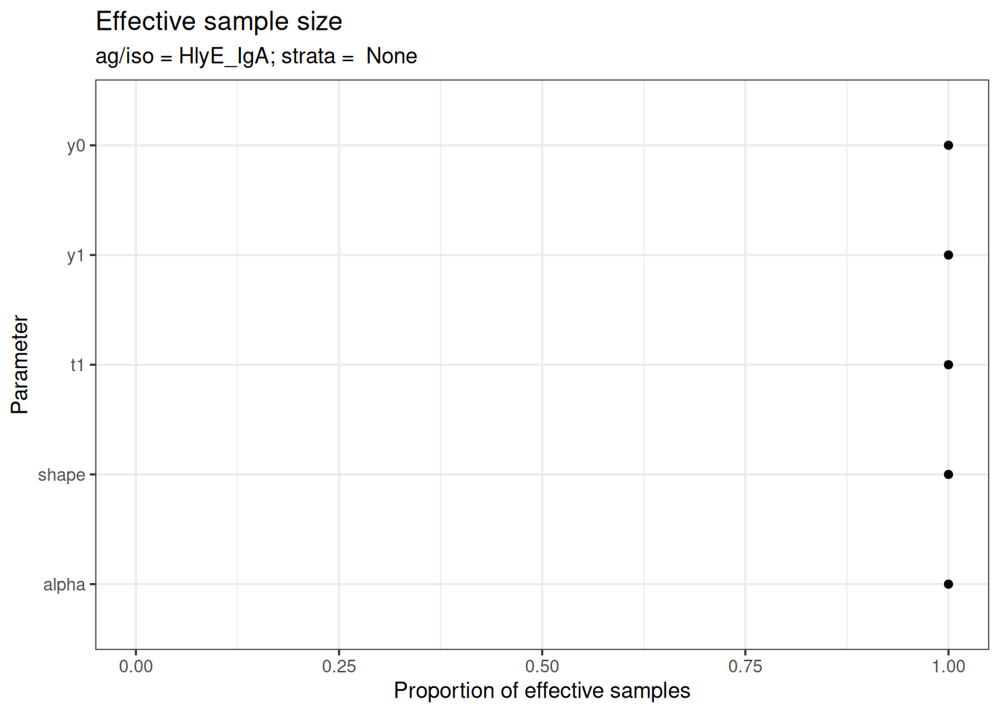

# Getting Started with serodynamics

## Introduction

The [serodynamics](https://github.com/UCD-SERG/serodynamics) package
provides tools for modeling longitudinal antibody responses to infection
using Bayesian MCMC methods. This vignette demonstrates the main
workflow for:

1.  Loading or simulating case data
2.  Preparing data for MCMC analysis
3.  Running the Bayesian model
4.  Visualizing and interpreting results

## Installation

First, ensure you have JAGS installed on your system (required for
Bayesian MCMC):

- **Ubuntu/Linux**: `sudo apt-get install jags`
- **macOS**: Download from [JAGS
  website](https://sourceforge.net/projects/mcmc-jags/)
- **Windows**: Download from [JAGS
  website](https://sourceforge.net/projects/mcmc-jags/)

Then install the package:

``` r
# install.packages("pak")
pak::pak("UCD-SERG/serodynamics")
```

## Load Required Libraries

``` r
library(serodynamics)
library(runjags)
library(dplyr)
library(ggplot2)

# Verify JAGS is installed
runjags::findJAGS()
#> [1] "/usr/bin/jags"
```

## Example 1: Using Existing Data

The package includes example data from the SEES Typhoid study in Nepal:

``` r
data(nepal_sees)
head(nepal_sees)
#> # A tibble: 6 × 9
#>   Country id      sample_id bldculres antigen_iso studyvisit dayssincefeveronset
#>   <chr>   <chr>   <chr>     <chr>     <chr>       <chr>                    <dbl>
#> 1 Nepal   sees_n… N000_122  typhi     HlyE_IgA    28_days                     40
#> 2 Nepal   sees_n… N000_122  typhi     HlyE_IgG    28_days                     40
#> 3 Nepal   sees_n… N000_297  typhi     HlyE_IgA    3_months                   135
#> 4 Nepal   sees_n… N000_297  typhi     HlyE_IgG    3_months                   135
#> 5 Nepal   sees_n… N000_372  typhi     HlyE_IgA    6_months                   171
#> 6 Nepal   sees_n… N000_372  typhi     HlyE_IgG    6_months                   171
#> # ℹ 2 more variables: result <dbl>, visit_num <int>
```

### Prepare the Data

Convert the data to a `case_data` object (`nepal_sees` already is a
`case_data` object, but we can reconvert it just to demonstrate).

``` r
case_data <- as_case_data(
  nepal_sees,
  id_var = "id",
  time_in_days = "dayssincefeveronset",
  value_var = "result",
  biomarker_var = "antigen_iso"
)

# View the structure
head(case_data)
#> # A tibble: 6 × 9
#>   Country id      sample_id bldculres antigen_iso studyvisit dayssincefeveronset
#>   <chr>   <chr>   <chr>     <chr>     <chr>       <chr>                    <dbl>
#> 1 Nepal   sees_n… N000_122  typhi     HlyE_IgA    28_days                     40
#> 2 Nepal   sees_n… N000_122  typhi     HlyE_IgG    28_days                     40
#> 3 Nepal   sees_n… N000_297  typhi     HlyE_IgA    3_months                   135
#> 4 Nepal   sees_n… N000_297  typhi     HlyE_IgG    3_months                   135
#> 5 Nepal   sees_n… N000_372  typhi     HlyE_IgA    6_months                   171
#> 6 Nepal   sees_n… N000_372  typhi     HlyE_IgG    6_months                   171
#> # ℹ 2 more variables: result <dbl>, visit_num <int>
```

### Visualize the Raw Data

``` r
autoplot(case_data)
```


## Example 2: Simulating Data

You can also simulate case data using antibody curve parameters:

``` r
set.seed(123)

# Use typhoid curve parameters from serocalculator
simulated_data <- sim_case_data(
  n = 50,  # Number of cases to simulate
  curve_params = serocalculator::typhoid_curves_nostrat_100,
  max_n_obs = 6,  # Maximum observations per case
  followup_interval = 14  # Days between follow-up visits
)

head(simulated_data)
#> # A tibble: 6 × 11
#>   id    visit_num timeindays  iter antigen_iso    y0     y1    t1    alpha     r
#>   <chr>     <int>      <dbl> <int> <fct>       <dbl>  <dbl> <dbl>    <dbl> <dbl>
#> 1 1             1          0    89 HlyE_IgA    0.666   47.1  7.18  5.22e-4  1.56
#> 2 1             1          0    89 HlyE_IgG    3.52   266.   5.60  1.25e-3  1.53
#> 3 1             1          0    89 LPS_IgA     1.77  2071.   1.71  2.21e-5  3.45
#> 4 1             1          0    89 LPS_IgG     0.200  234.   5.30  1.69e-3  1.28
#> 5 1             1          0    89 Vi_IgG      1.66   543.   8.37  3.72e-5  1.26
#> 6 1             2         14    89 HlyE_IgA    0.666   47.1  7.18  5.22e-4  1.56
#> # ℹ 1 more variable: value <dbl>
```

``` r
autoplot(simulated_data)
```


## Running the Bayesian Model

The main function
[`run_mod()`](https:/ucd-serg.github.io/serodynamics/preview/pr163/reference/run_mod.md)
fits a Bayesian MCMC model to estimate antibody dynamic curve
parameters:

- `y0`: Baseline antibody concentration
- `y1`: Peak antibody concentration  
- `t1`: Time to peak
- `shape`: Shape parameter
- `alpha`: Decay rate

``` r
# Note: This example uses reduced iterations for demonstration
# For actual analysis, use larger values (e.g., nmc=1000, niter=2000)

fitted_model <- run_mod(
  data = simulated_data,
  file_mod = serodynamics_example("model.jags"),
  nchain = 2,      # Number of MCMC chains
  nadapt = 100,    # Adaptation iterations
  nburn = 100,     # Burn-in iterations  
  nmc = 10,        # Samples per chain (use 1000+ for real analysis)
  niter = 20       # Total iterations (use 2000+ for real analysis)
)
#> Calling 2 simulations using the parallel method...
#> Following the progress of chain 1 (the program will wait for all chains
#> to finish before continuing):
#> Welcome to JAGS 4.3.2 on Thu Jan  8 03:11:07 2026
#> JAGS is free software and comes with ABSOLUTELY NO WARRANTY
#> Loading module: basemod: ok
#> Loading module: bugs: ok
#> . . Reading data file data.txt
#> . Compiling model graph
#>    Resolving undeclared variables
#>    Allocating nodes
#> Graph information:
#>    Observed stochastic nodes: 815
#>    Unobserved stochastic nodes: 285
#>    Total graph size: 14771
#> . Reading parameter file inits1.txt
#> . Initializing model
#> . Adapting 100
#> -------------------------------------------------| 100
#> ++++++++++++++++++++++++++++++++++++++++++++++++++ 100%
#> Adaptation incomplete.
#> . Updating 100
#> -------------------------------------------------| 100
#> ************************************************** 100%
#> . . . . . . Updating 20
#> . . . . Updating 0
#> . Deleting model
#> . 
#> All chains have finished
#> Warning: The adaptation phase of one or more models was not completed in 100
#> iterations, so the current samples may not be optimal - try increasing the
#> number of iterations to the "adapt" argument
#> Simulation complete.  Reading coda files...
#> Coda files loaded successfully
#> Finished running the simulation

head(fitted_model)
#> # A tibble: 6 × 7
#>   Iteration Chain Parameter Iso_type Stratification Subject  value
#>       <int> <int> <chr>     <chr>    <chr>          <chr>    <dbl>
#> 1         1     1 alpha     HlyE_IgA None           1       0.0114
#> 2         2     1 alpha     HlyE_IgA None           1       0.0114
#> 3         3     1 alpha     HlyE_IgA None           1       0.0114
#> 4         4     1 alpha     HlyE_IgA None           1       0.0114
#> 5         5     1 alpha     HlyE_IgA None           1       0.0217
#> 6         6     1 alpha     HlyE_IgA None           1       0.0217
```

## Model Diagnostics

After fitting the model, check convergence diagnostics:

``` r
# Trace plots to assess chain mixing
plot_jags_trace(fitted_model)
#> $None
#> $None$HlyE_IgA
```


    #>
    #> $None$HlyE_IgG


    #>
    #> $None$LPS_IgA


    #>
    #> $None$LPS_IgG


    #>
    #> $None$Vi_IgG


``` r

# Density plots of posterior distributions
plot_jags_dens(fitted_model)
#> $None
#> $None$HlyE_IgA
```


    #>
    #> $None$HlyE_IgG


    #>
    #> $None$LPS_IgA


    #>
    #> $None$LPS_IgG


    #>
    #> $None$Vi_IgG


``` r

# Rhat statistics (values near 1.0 indicate convergence)
plot_jags_Rhat(fitted_model)
#> $None
#> $None$HlyE_IgA
```


    #>
    #> $None$HlyE_IgG


    #>
    #> $None$LPS_IgA


    #>
    #> $None$LPS_IgG


    #>
    #> $None$Vi_IgG


``` r

# Effective sample size
plot_jags_effect(fitted_model)
#> $None
#> $None$HlyE_IgA
```



    #>
    #> $None$HlyE_IgG


    #>
    #> $None$LPS_IgA


    #>
    #> $None$LPS_IgG


    #>
    #> $None$Vi_IgG


## Visualizing Fitted Curves

Plot the predicted antibody curves with credible intervals:

``` r
plot_predicted_curve(
  fitted_model,
  ids = serocalculator::ids(simulated_data)[1],
  antigen_iso = simulated_data$antigen_iso[1]
)
```


## Post-Processing Results

Extract and summarize the posterior estimates:

``` r
# Summarize parameter estimates
summary_stats <- post_summ(fitted_model)
print(summary_stats)
#> # A tibble: 25 × 11
#>    Iso_type Parameter Stratification       Mean       SD  Median  `2.5%` `25.0%`
#>    <chr>    <chr>     <chr>               <dbl>    <dbl>   <dbl>   <dbl>   <dbl>
#>  1 HlyE_IgA alpha     None              0.0132   9.15e-3 1.08e-2 3.87e-3 6.37e-3
#>  2 HlyE_IgA shape     None              1.47     1.01e-1 1.44e+0 1.34e+0 1.39e+0
#>  3 HlyE_IgA t1        None              2.02     4.93e-1 2.07e+0 1.15e+0 1.67e+0
#>  4 HlyE_IgA y0        None              2.13     3.68e-1 2.17e+0 1.46e+0 1.89e+0
#>  5 HlyE_IgA y1        None           1105.       1.55e+3 7.14e+2 4.82e+1 4.59e+2
#>  6 HlyE_IgG alpha     None              0.00956  8.14e-3 6.50e-3 1.77e-3 3.22e-3
#>  7 HlyE_IgG shape     None              1.36     9.20e-2 1.38e+0 1.25e+0 1.28e+0
#>  8 HlyE_IgG t1        None              1.94     4.89e-1 1.80e+0 1.35e+0 1.57e+0
#>  9 HlyE_IgG y0        None              2.85     7.70e-1 2.60e+0 2.01e+0 2.49e+0
#> 10 HlyE_IgG y1        None            833.       1.19e+3 2.95e+2 7.01e+1 2.42e+2
#> # ℹ 15 more rows
#> # ℹ 3 more variables: `50.0%` <dbl>, `75.0%` <dbl>, `97.5%` <dbl>
```

## Working with Stratified Data

You can stratify the analysis by a grouping variable:

``` r
# Create stratified data
strat1 <- sim_case_data(
  n = 30, 
  curve_params = serocalculator::typhoid_curves_nostrat_100
) |>
  mutate(pathogen = "Typhoid")

strat2 <- sim_case_data(
  n = 30,
  curve_params = serocalculator::typhoid_curves_nostrat_100  
) |>
  mutate(pathogen = "Paratyphoid")

stratified_data <- bind_rows(strat1, strat2)

# Fit model with stratification
fitted_stratified <- run_mod(
  data = stratified_data,
  file_mod = serodynamics_example("model.jags"),
  nchain = 2,
  nadapt = 100,
  nburn = 100,
  nmc = 10,
  niter = 20,
  strat = "pathogen"  # Specify stratification variable
)
#> Calling 2 simulations using the parallel method...
#> Following the progress of chain 1 (the program will wait for all chains
#> to finish before continuing):
#> Welcome to JAGS 4.3.2 on Thu Jan  8 03:11:20 2026
#> JAGS is free software and comes with ABSOLUTELY NO WARRANTY
#> Loading module: basemod: ok
#> Loading module: bugs: ok
#> . . Reading data file data.txt
#> . Compiling model graph
#>    Resolving undeclared variables
#>    Allocating nodes
#> Graph information:
#>    Observed stochastic nodes: 775
#>    Unobserved stochastic nodes: 185
#>    Total graph size: 12303
#> . Reading parameter file inits1.txt
#> . Initializing model
#> . Adapting 100
#> -------------------------------------------------| 100
#> ++++++++++++++++++++++++++++++++++++++++++++++++++ 100%
#> Adaptation incomplete.
#> . Updating 100
#> -------------------------------------------------| 100
#> ************************************************** 100%
#> . . . . . . Updating 20
#> . . . . Updating 0
#> . Deleting model
#> . 
#> All chains have finished
#> Warning: The adaptation phase of one or more models was not completed in 100
#> iterations, so the current samples may not be optimal - try increasing the
#> number of iterations to the "adapt" argument
#> Simulation complete.  Reading coda files...
#> Coda files loaded successfully
#> Finished running the simulation
#> Calling 2 simulations using the parallel method...
#> Following the progress of chain 1 (the program will wait for all chains
#> to finish before continuing):
#> Welcome to JAGS 4.3.2 on Thu Jan  8 03:11:22 2026
#> JAGS is free software and comes with ABSOLUTELY NO WARRANTY
#> Loading module: basemod: ok
#> Loading module: bugs: ok
#> . . Reading data file data.txt
#> . Compiling model graph
#>    Resolving undeclared variables
#>    Allocating nodes
#> Graph information:
#>    Observed stochastic nodes: 760
#>    Unobserved stochastic nodes: 185
#>    Total graph size: 12135
#> . Reading parameter file inits1.txt
#> . Initializing model
#> . Adapting 100
#> -------------------------------------------------| 100
#> ++++++++++++++++++++++++++++++++++++++++++++++++++ 100%
#> Adaptation incomplete.
#> . Updating 100
#> -------------------------------------------------| 100
#> ************************************************** 100%
#> . . . . . . Updating 20
#> . . . . Updating 0
#> . Deleting model
#> . 
#> All chains have finished
#> Warning: The adaptation phase of one or more models was not completed in 100
#> iterations, so the current samples may not be optimal - try increasing the
#> number of iterations to the "adapt" argument
#> Simulation complete.  Reading coda files...
#> Coda files loaded successfully
#> Finished running the simulation
```

## Next Steps

- See the [function
  reference](https:/ucd-serg.github.io/serodynamics/preview/pr163/reference/index.md)
  for complete API documentation
- Check out example datasets:
  [`?nepal_sees`](https:/ucd-serg.github.io/serodynamics/preview/pr163/reference/nepal_sees.md),
  [`?nepal_sees_jags_output`](https:/ucd-serg.github.io/serodynamics/preview/pr163/reference/nepal_sees_jags_output.md)

## Session Info

``` r
sessioninfo::session_info()
#> ─ Session info ───────────────────────────────────────────────────────────────
#>  setting  value
#>  version  R version 4.5.2 (2025-10-31)
#>  os       Ubuntu 24.04.3 LTS
#>  system   x86_64, linux-gnu
#>  ui       X11
#>  language en-US
#>  collate  C.UTF-8
#>  ctype    C.UTF-8
#>  tz       UTC
#>  date     2026-01-08
#>  pandoc   3.1.11 @ /opt/hostedtoolcache/pandoc/3.1.11/x64/ (via rmarkdown)
#>  quarto   1.8.26 @ /usr/local/bin/quarto
#> 
#> ─ Packages ───────────────────────────────────────────────────────────────────
#>  package        * version    date (UTC) lib source
#>  cli              3.6.5      2025-04-23 [1] CRAN (R 4.5.2)
#>  coda             0.19-4.1   2024-01-31 [1] CRAN (R 4.5.2)
#>  codetools        0.2-20     2024-03-31 [3] CRAN (R 4.5.2)
#>  digest           0.6.39     2025-11-19 [1] CRAN (R 4.5.2)
#>  doParallel       1.0.17     2022-02-07 [1] CRAN (R 4.5.2)
#>  dplyr          * 1.1.4      2023-11-17 [1] CRAN (R 4.5.2)
#>  evaluate         1.0.5      2025-08-27 [1] CRAN (R 4.5.2)
#>  farver           2.1.2      2024-05-13 [1] CRAN (R 4.5.2)
#>  fastmap          1.2.0      2024-05-15 [1] CRAN (R 4.5.2)
#>  foreach          1.5.2      2022-02-02 [1] CRAN (R 4.5.2)
#>  fs               1.6.6      2025-04-12 [1] CRAN (R 4.5.2)
#>  generics         0.1.4      2025-05-09 [1] CRAN (R 4.5.2)
#>  GGally           2.4.0      2025-08-23 [1] CRAN (R 4.5.2)
#>  ggmcmc           1.5.1.2    2025-10-02 [1] CRAN (R 4.5.2)
#>  ggplot2        * 4.0.1      2025-11-14 [1] CRAN (R 4.5.2)
#>  ggstats          0.12.0     2025-12-22 [1] CRAN (R 4.5.2)
#>  glue             1.8.0      2024-09-30 [1] CRAN (R 4.5.2)
#>  gtable           0.3.6      2024-10-25 [1] CRAN (R 4.5.2)
#>  htmltools        0.5.9      2025-12-04 [1] CRAN (R 4.5.2)
#>  iterators        1.0.14     2022-02-05 [1] CRAN (R 4.5.2)
#>  jsonlite         2.0.0      2025-03-27 [1] CRAN (R 4.5.2)
#>  knitr            1.51       2025-12-20 [1] CRAN (R 4.5.2)
#>  labeling         0.4.3      2023-08-29 [1] CRAN (R 4.5.2)
#>  lattice          0.22-7     2025-04-02 [3] CRAN (R 4.5.2)
#>  lifecycle        1.0.4      2023-11-07 [1] CRAN (R 4.5.2)
#>  magrittr         2.0.4      2025-09-12 [1] CRAN (R 4.5.2)
#>  MASS             7.3-65     2025-02-28 [3] CRAN (R 4.5.2)
#>  otel             0.2.0      2025-08-29 [1] CRAN (R 4.5.2)
#>  pillar           1.11.1     2025-09-17 [1] CRAN (R 4.5.2)
#>  pkgconfig        2.0.3      2019-09-22 [1] CRAN (R 4.5.2)
#>  purrr            1.2.0      2025-11-04 [1] CRAN (R 4.5.2)
#>  R6               2.6.1      2025-02-15 [1] CRAN (R 4.5.2)
#>  RColorBrewer     1.1-3      2022-04-03 [1] CRAN (R 4.5.2)
#>  Rcpp             1.1.0      2025-07-02 [1] CRAN (R 4.5.2)
#>  rlang            1.1.6      2025-04-11 [1] CRAN (R 4.5.2)
#>  rmarkdown        2.30       2025-09-28 [1] CRAN (R 4.5.2)
#>  rngtools         1.5.2      2021-09-20 [1] CRAN (R 4.5.2)
#>  runjags        * 2.2.2-5    2025-04-09 [1] CRAN (R 4.5.2)
#>  S7               0.2.1      2025-11-14 [1] CRAN (R 4.5.2)
#>  scales           1.4.0      2025-04-24 [1] CRAN (R 4.5.2)
#>  serocalculator   1.3.0.9061 2025-12-16 [1] Github (ucd-serg/serocalculator@4fc3b75)
#>  serodynamics   * 0.0.0.9047 2026-01-08 [1] local
#>  sessioninfo      1.2.3      2025-02-05 [1] any (@1.2.3)
#>  tibble           3.3.0      2025-06-08 [1] CRAN (R 4.5.2)
#>  tidyr            1.3.2      2025-12-19 [1] CRAN (R 4.5.2)
#>  tidyselect       1.2.1      2024-03-11 [1] CRAN (R 4.5.2)
#>  utf8             1.2.6      2025-06-08 [1] CRAN (R 4.5.2)
#>  vctrs            0.6.5      2023-12-01 [1] CRAN (R 4.5.2)
#>  withr            3.0.2      2024-10-28 [1] CRAN (R 4.5.2)
#>  xfun             0.55       2025-12-16 [1] CRAN (R 4.5.2)
#>  yaml             2.3.12     2025-12-10 [1] CRAN (R 4.5.2)
#> 
#>  [1] /home/runner/work/_temp/Library
#>  [2] /opt/R/4.5.2/lib/R/site-library
#>  [3] /opt/R/4.5.2/lib/R/library
#>  * ── Packages attached to the search path.
#> 
#> ──────────────────────────────────────────────────────────────────────────────
```
