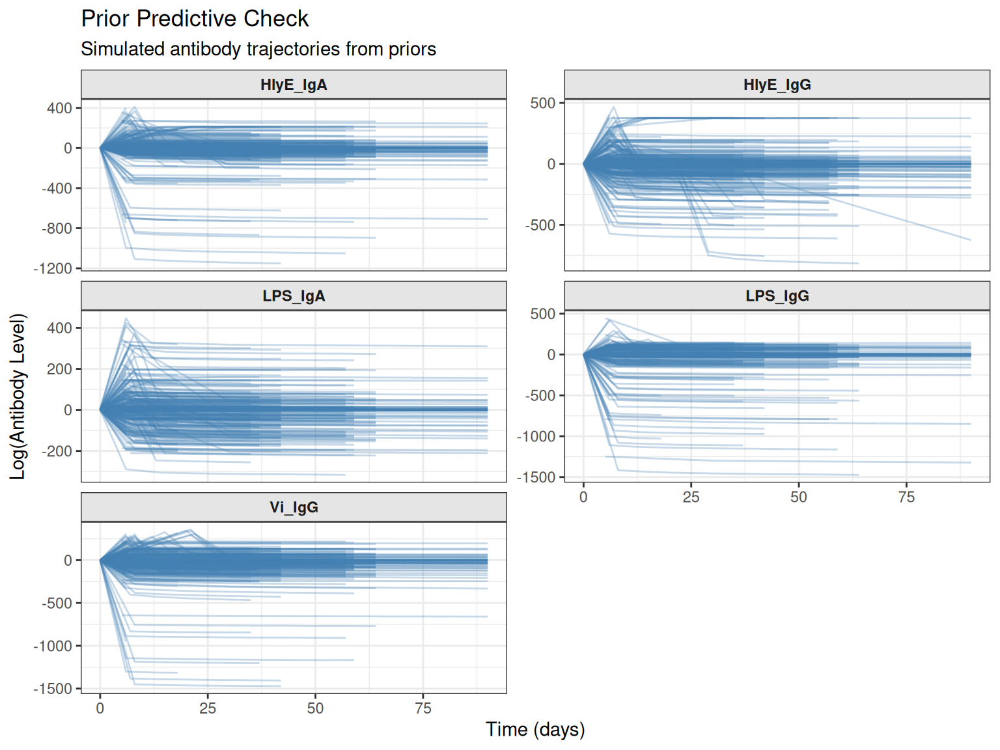
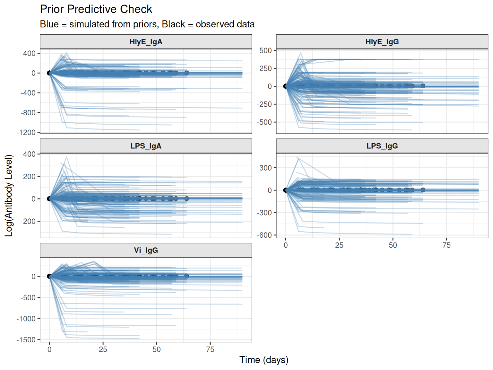
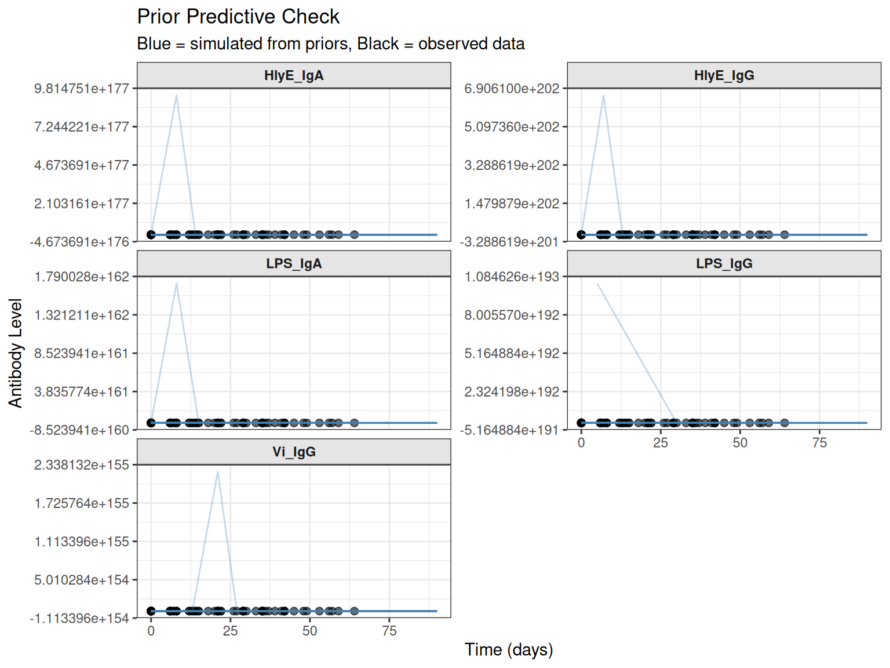
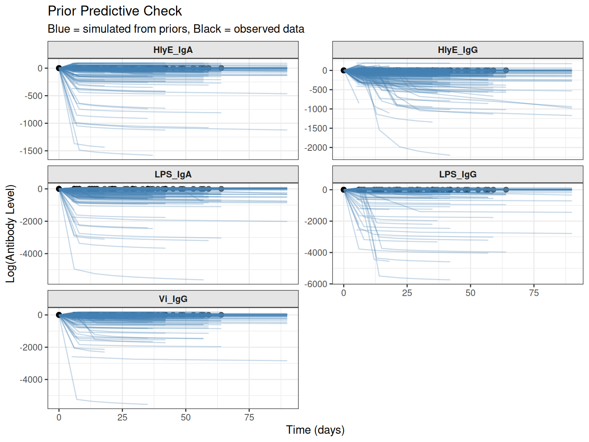

# Prior Predictive Checks

## Introduction

Prior predictive checks (PPCs) are a critical step in Bayesian workflow,
allowing you to assess whether your prior distributions generate
realistic data **before** fitting the model. This is especially
important in serodynamics because:

- Different pathogens and assays operate on **very different measurement
  scales** (e.g., Shigella MFI vs. ELISA OD or titers)
- Poorly scaled priors can generate unrealistic antibody trajectories
- Prior predictive checks help identify issues **before** expensive MCMC
  sampling

This vignette demonstrates how to perform prior predictive checks using
the `serodynamics` package.

## Load Required Libraries

``` r
library(serodynamics)
library(dplyr)
#> 
#> Attaching package: 'dplyr'
#> The following objects are masked from 'package:stats':
#> 
#>     filter, lag
#> The following objects are masked from 'package:base':
#> 
#>     intersect, setdiff, setequal, union
set.seed(123)
```

## Basic Workflow

The basic prior predictive check workflow involves three steps:

1.  **Simulate** antibody trajectories from priors using
    [`simulate_prior_predictive()`](https:/ucd-serg.github.io/serodynamics/preview/pr178/reference/simulate_prior_predictive.md)
2.  **Summarize** the simulated data using
    [`summarize_prior_predictive()`](https:/ucd-serg.github.io/serodynamics/preview/pr178/reference/summarize_prior_predictive.md)
3.  **Visualize** the trajectories using
    [`plot_prior_predictive()`](https:/ucd-serg.github.io/serodynamics/preview/pr178/reference/plot_prior_predictive.md)

## Example: Typhoid Data

Let’s demonstrate with simulated typhoid data:

### 1. Prepare Data and Priors

First, prepare your data and specify priors:

``` r
# Simulate some case data
raw_data <- serocalculator::typhoid_curves_nostrat_100 |>
  sim_case_data(n = 10)

# Prepare data for JAGS
prepped_data <- prep_data(raw_data)

# Prepare default priors
prepped_priors <- prep_priors(max_antigens = prepped_data$n_antigen_isos)
```

### 2. Simulate from Priors

Generate simulated data using only the prior distributions:

``` r
# Generate a single simulation
sim_data <- simulate_prior_predictive(
  prepped_data, 
  prepped_priors,
  seed = 456
)

# Or generate multiple simulations for better coverage
sim_list <- simulate_prior_predictive(
  prepped_data,
  prepped_priors,
  n_sims = 50,
  seed = 456
)
```

### 3. Summarize Simulated Data

Check for potential issues with the priors:

``` r
# Summarize the simulations
summary <- summarize_prior_predictive(sim_list, original_data = prepped_data)
print(summary)
#> 
#> ── Prior Predictive Check Summary ──────────────────────────────────────────────
#> Based on 50 simulations
#> 
#> ── Validity Check ──
#> 
#>   biomarker n_finite n_nonfinite n_negative
#> 1  HlyE_IgA     3250           0       1174
#> 2  HlyE_IgG     3250           0       1099
#> 3   LPS_IgA     3230           0        779
#> 4   LPS_IgG     3250           0        766
#> 5    Vi_IgG     3250           0       1393
#> 
#> ── Simulated Range Summary (log scale) ──
#> 
#>   biomarker        min        q25       median      q75      max
#> 1  HlyE_IgA -1152.3644 -20.302477 -0.007312568 2.745785 409.7927
#> 2  HlyE_IgG  -816.8093 -24.789868  0.260584555 2.971617 467.0058
#> 3   LPS_IgA  -316.4156  -2.992139  0.842760223 4.218828 446.6334
#> 4   LPS_IgG -1472.6225  -3.688993  1.107351193 3.226404 444.4314
#> 5    Vi_IgG -1471.8015 -33.278147 -0.062605307 2.140201 357.7013
#> 
#> ── Observed Data Range (log scale) ──
#> 
#>   biomarker   obs_min obs_median  obs_max
#> 1  HlyE_IgA -1.638860   3.466686 6.414373
#> 2  HlyE_IgG -0.584576   4.649386 5.714962
#> 3   LPS_IgA -0.737148   2.865291 6.277741
#> 4   LPS_IgG -0.307534   3.343951 5.113420
#> 5    Vi_IgG  0.233438   6.709262 8.110332
#> 
#> ── Issues Detected ──
#> 
#> ! Very low/negative log-scale values detected for biomarker(s): HlyE_IgA,
#>   HlyE_IgG, LPS_IgA, LPS_IgG, Vi_IgG (may indicate prior-data scale mismatch)
#> ! Simulated range for HlyE_IgA is much wider than observed data (may indicate
#>   over-dispersed priors)
#> ! Simulated range for HlyE_IgG is much wider than observed data (may indicate
#>   over-dispersed priors)
#> ! Simulated range for LPS_IgA is much wider than observed data (may indicate
#>   over-dispersed priors)
#> ! Simulated range for LPS_IgG is much wider than observed data (may indicate
#>   over-dispersed priors)
#> ! Simulated range for Vi_IgG is much wider than observed data (may indicate
#>   over-dispersed priors)
```

The summary includes:

- **Validity check**: Counts of finite, non-finite, and negative values
  by biomarker
- **Range summary**: Quantiles of simulated values (on log scale)
- **Observed range**: Comparison with actual data (when provided)
- **Issues detected**: Warnings about potential problems

### 4. Visualize Prior Predictive Trajectories

Plot the simulated trajectories to visually assess whether they look
realistic:

``` r
# Plot simulated trajectories only
plot_prior_predictive(sim_list)
```



#### Overlay with Observed Data

Compare simulated trajectories with actual data to assess scale:

``` r
# Plot with observed data overlay
plot_prior_predictive(
  sim_list, 
  original_data = prepped_data,
  max_traj = 30  # Limit number of trajectories for clarity
)
#> Plotting 30 of 50 simulations for clarity
```



Blue lines show simulated trajectories, while black lines/points show
the observed data. If the simulated trajectories have a very different
scale or pattern than the observed data, your priors may need
adjustment.

#### Natural Scale vs. Log Scale

By default, plots use the log scale (matching the model). You can also
view on the natural scale:

``` r
# Plot on natural scale
plot_prior_predictive(
  sim_list,
  original_data = prepped_data,
  log_scale = FALSE,
  max_traj = 30
)
#> Plotting 30 of 50 simulations for clarity
```



## Custom Priors

If the default priors don’t generate realistic trajectories, you can
adjust them:

``` r
# Define custom priors with different parameter values
custom_priors <- prep_priors(
  max_antigens = prepped_data$n_antigen_isos,
  mu_hyp_param = c(1.0, 5.0, 0.5, -3.0, -2.0),      # Adjust means
  prec_hyp_param = c(0.5, 0.0001, 0.5, 0.002, 0.5),  # Adjust precisions
  omega_param = c(2.0, 30.0, 2.0, 8.0, 2.0),         # Adjust variability
  wishdf_param = 15,
  prec_logy_hyp_param = c(3.0, 0.8)
)

# Simulate with custom priors
custom_sim <- simulate_prior_predictive(
  prepped_data,
  custom_priors,
  n_sims = 50,
  seed = 789
)

# Check results
custom_summary <- summarize_prior_predictive(custom_sim, original_data = prepped_data)
print(custom_summary)
#> 
#> ── Prior Predictive Check Summary ──────────────────────────────────────────────
#> Based on 50 simulations
#> 
#> ── Validity Check ──
#> 
#>   biomarker n_finite n_nonfinite n_negative
#> 1  HlyE_IgA     3250           0        953
#> 2  HlyE_IgG     3250           0       1515
#> 3   LPS_IgA     3250           0       1198
#> 4   LPS_IgG     3250           0        642
#> 5    Vi_IgG     3250           0       1426
#> 
#> ── Simulated Range Summary (log scale) ──
#> 
#>   biomarker       min         q25     median       q75      max
#> 1  HlyE_IgA -1581.999 -12.1427265  0.6664205  4.469351 227.7868
#> 2  HlyE_IgG -2202.964 -88.7754474 -1.8232447  1.998208 192.3581
#> 3   LPS_IgA -5620.001 -69.4492727 -0.1016361 15.329133 144.3723
#> 4   LPS_IgG -5740.150  -0.9890486  1.3026949  4.934066 192.8489
#> 5    Vi_IgG -5542.095 -56.1782107 -1.1343742  1.771347 193.9061
#> 
#> ── Observed Data Range (log scale) ──
#> 
#>   biomarker   obs_min obs_median  obs_max
#> 1  HlyE_IgA -1.638860   3.466686 6.414373
#> 2  HlyE_IgG -0.584576   4.649386 5.714962
#> 3   LPS_IgA -0.737148   2.865291 6.277741
#> 4   LPS_IgG -0.307534   3.343951 5.113420
#> 5    Vi_IgG  0.233438   6.709262 8.110332
#> 
#> ── Issues Detected ──
#> 
#> ! Very low/negative log-scale values detected for biomarker(s): HlyE_IgA,
#>   HlyE_IgG, LPS_IgA, LPS_IgG, Vi_IgG (may indicate prior-data scale mismatch)
#> ! Simulated range for HlyE_IgA is much wider than observed data (may indicate
#>   over-dispersed priors)
#> ! Simulated range for HlyE_IgG is much wider than observed data (may indicate
#>   over-dispersed priors)
#> ! Simulated range for LPS_IgA is much wider than observed data (may indicate
#>   over-dispersed priors)
#> ! Simulated range for LPS_IgG is much wider than observed data (may indicate
#>   over-dispersed priors)
#> ! Simulated range for Vi_IgG is much wider than observed data (may indicate
#>   over-dispersed priors)
```

``` r
plot_prior_predictive(
  custom_sim,
  original_data = prepped_data,
  max_traj = 30
)
#> Plotting 30 of 50 simulations for clarity
```



## Interpreting Results

### Good Prior Predictive Check

A well-specified prior should generate:

- **Finite values**: All simulated antibody levels should be finite (no
  NaN, Inf, or -Inf)
- **Reasonable scale**: Simulated ranges should roughly overlap with
  observed data ranges
- **Realistic trajectories**: Curves should show plausible antibody
  kinetics (rise and decay)

### Warning Signs

Be concerned if you see:

- **Non-finite values**: Indicates mathematical issues with parameter
  combinations
- **Extreme values**: Very large or very small antibody levels that are
  biologically implausible
- **Scale mismatch**: Simulated data ranges orders of magnitude
  different from observed data
- **Unrealistic patterns**: Trajectories that don’t follow expected
  antibody kinetics

## Integration with Model Fitting

Once you’re satisfied with the prior predictive check, proceed to model
fitting:

``` r
# After confirming priors are reasonable, fit the model
fitted_model <- run_mod(
  data = raw_data,
  file_mod = serodynamics_example("model.jags"),
  nchain = 4,
  nadapt = 1000,
  nburn = 1000,
  nmc = 1000,
  niter = 2000,
  # Use the custom priors you validated
  mu_hyp_param = c(1.0, 5.0, 0.5, -3.0, -2.0),
  prec_hyp_param = c(0.5, 0.0001, 0.5, 0.002, 0.5),
  omega_param = c(2.0, 30.0, 2.0, 8.0, 2.0),
  wishdf_param = 15,
  prec_logy_hyp_param = c(3.0, 0.8)
)
```

## Best Practices

1.  **Always run prior predictive checks** before fitting models,
    especially when:

    - Working with a new pathogen or assay
    - Using non-default priors
    - Data are on an unfamiliar scale

2.  **Generate enough simulations** (50-100) to see the full range of
    prior-implied trajectories

3.  **Compare with observed data** to ensure priors are on the right
    scale

4.  **Iterate on priors** if simulations show problems, then re-run the
    prior predictive check

5.  **Document your choices** about why you selected particular prior
    values

## Summary

Prior predictive checks are a simple but powerful tool for:

- Validating that priors generate realistic antibody trajectories
- Identifying scale mismatches before expensive MCMC fitting
- Building intuition about how priors translate to observable data
- Catching mathematical issues (e.g., negative values in log functions)

By incorporating prior predictive checks into your workflow, you can
avoid many common pitfalls in Bayesian modeling and ensure more robust
inference.
