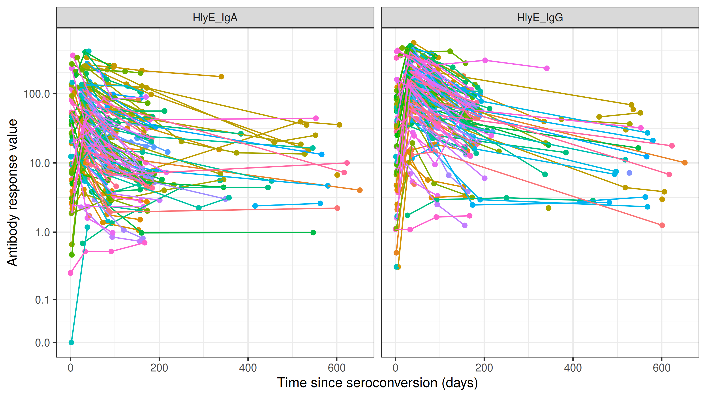
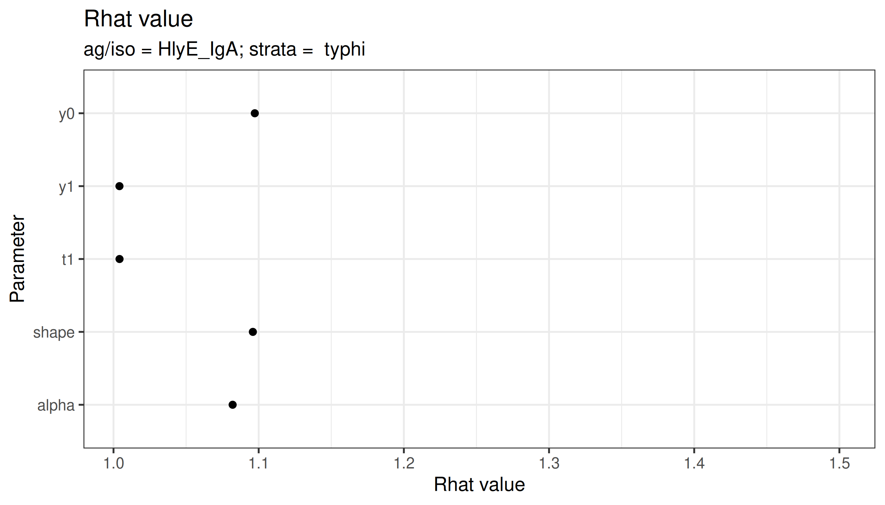
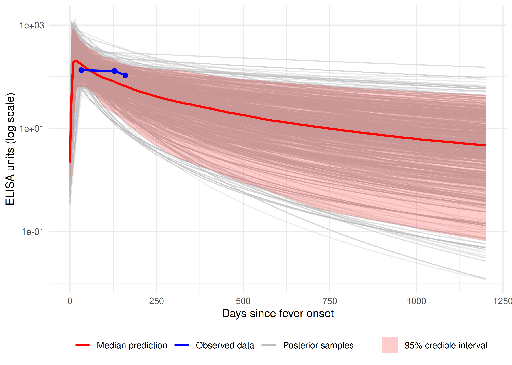

# Software Application Profile: serodynamics, an R package for modeling longitudinal antibody kinetics from confirmed infection data

## Abstract

**Motivation:** Estimating seroincidence, or the rate at which new
infections occur in a population, from cross-sectional serological data
requires well-characterized models of post-infection antibody kinetics.
Fitting these models using longitudinal data from confirmed cases
requires statistical implementations for each pathogen, limiting
reproducibility and accessibility.

**Implementation:** `serodynamics` is an open-source R package that fits
two-phase within-host antibody kinetic models using a Bayesian
hierarchical framework and Markov chain Monte Carlo (MCMC) sampling via
JAGS. The package estimates five kinetic parameters per antigen–isotype
combination: baseline antibody level, peak concentration, time to peak,
decay rate, and decay shape.

**General features:** The package supports data preparation, case data
simulation, prior specification, stratified model fitting, convergence
diagnostics, and posterior visualization. Output is directly compatible
with the `serocalculator` package for downstream seroincidence
estimation from cross-sectional surveys.

**Availability:** The package `serodynamics` is freely available on
GitHub (<https://github.com/UCD-SERG/serodynamics>), with documentation
at <https://UCD-SERG.github.io/serodynamics/>.

**Supplementary information:**

**Keywords:** antibody kinetics, seroepidemiology, Bayesian hierarchical
model, seroincidence, R package, MCMC

> **Note to reviewers (to be removed before submission)**
>
> All three numbered figures in the **Use** section are rendered live
> from the R code chunks shown directly above them, using the
> `nepal_sees` case data and the `nepal_sees_jags_output` pre-fitted
> MCMC output that are shipped with the package. Two code chunks are
> intentionally not executed at render time: the full
> [`run_mod()`](https:/ucd-serg.github.io/serodynamics/preview/pr221/reference/run_mod.md)
> call (because a four-chain × 30,000-iteration fit takes hours), and
> the end-to-end
> [`postprocess_jags_output()`](https:/ucd-serg.github.io/serodynamics/preview/pr221/reference/postprocess_jags_output.md)
> →
> [`serocalculator::est_seroincidence_by()`](https://ucd-serg.github.io/serocalculator/latest-tag/reference/est_seroincidence_by.html)
> pipeline (because it requires the raw `jags.post` object — saved only
> when
> [`run_mod()`](https:/ucd-serg.github.io/serodynamics/preview/pr221/reference/run_mod.md)
> is called with `with_post = TRUE` — together with cross-sectional
> survey data). For the camera-ready version we will execute the full
> pipeline once and cache the results so all chunks render reproducibly
> (tracked in \#238).

## Introduction

Serological surveys, or serosurveys, are epidemiologic studies that can
be used to measure population-level antibody responses to characterize
infection burden ([Simonsen et al. 2009](#ref-simonsen2009); [Teunis et
al. 2012](#ref-teunis2012)). Following exposure to a pathogen, the
adaptive immune system generates antigen-specific antibodies, which
increase rapidly after infection and gradually wane over time ([de Graaf
et al. 2014](#ref-graaf2014); [Teunis et al. 2016](#ref-teunis2016)).
The concentration of antibodies against a given pathogen can often be
used to estimate time since infection ([Hay et al. 2024](#ref-hay2024)).
In cross-sectional serosurveys, a large proportion of individuals with
high antibody concentrations suggests a high burden of infection, while
a smaller proportion indicates lower burden. However, the magnitude and
speed of an individual’s immune response to infection is complex and
dynamic, shaped by infectious dose, age, disease severity, prior
exposures, vaccination history, among many other factors, complicating
the interpretation of these measurements.

Population-level antibody responses are typically characterized using
two key epidemiological measures: seroprevalence, the proportion of
individuals with antibody levels above a defined threshold; and
seroincidence, the rate at which new infections occur in the population
([Simonsen et al. 2009](#ref-simonsen2009); [Teunis et al.
2012](#ref-teunis2012)). Most analytic methods used to estimate
seroprevalence dichotomize quantitative antibody levels into binary
outcomes—seropositive or seronegative. While simple and widely used,
this approach ignores temporal changes in antibody concentrations,
individual-level heterogeneity, and immunological cross-reactivity
between pathogens. In contrast, seroincidence rates quantify the rate at
which new infections occur and are increasingly favored by
epidemiologists, modelers, and public health professionals ([Aiemjoy et
al. 2022](#ref-aiemjoy2022); [Lai et al. 2025](#ref-lai2025)).
Seroincidence rates can help determine whether a disease has been
eliminated, differentiate between endemic and epidemic scenarios, and
identify risk factors for transmission, helping locate areas where
interventions are most needed.

New statistical methods have been developed to estimate seroincidence
rates from cross-sectional serosurveys by incorporating models of
antibody decay dynamics from confirmed cases ([Simonsen et al.
2009](#ref-simonsen2009); [Teunis and van Eijkeren
2020](#ref-teunis2020)). A critical upstream input for these methods is
a set of previously estimated longitudinal seroresponse parameters
describing how antibodies rise, peak, and decay following confirmed
infection. Seroincidence can then be estimated from serosurveys as a
function of peak antibody response and decay rate using previously
estimated antibody kinetic parameters while accounting for heterogeneity
in immunity, responses to multiple antigens, and laboratory assay
variability ([Teunis et al. 2016](#ref-teunis2016); [Teunis and van
Eijkeren 2020](#ref-teunis2020)).

To model post-infection antibody kinetics a two-phase within-host model
is deployed. Originally developed by de Graaf et al. ([de Graaf et al.
2014](#ref-graaf2014)) and extended by Teunis et al. ([Teunis et al.
2016](#ref-teunis2016); [Teunis and van Eijkeren
2020](#ref-teunis2020)), this model describes the post-infection
antibody response as an exponential rise driven by antigenic stimulation
followed by power-law decay reflecting heterogeneous plasma-cell
lifespans and prolonged immunity. When fitted within a Bayesian
hierarchical structure, individual-level parameters are stabilized by
borrowing strength across participants—important when longitudinal data
are sparse. This framework has previously been applied to pertussis ([de
Graaf et al. 2014](#ref-graaf2014)), typhoid fever ([Aiemjoy et al.
2022](#ref-aiemjoy2022)), scrub typhus ([Aiemjoy et al.
2024](#ref-aiemjoy2024)), and *Shigella* ([Lee et al.,
n.d.](#ref-lee_inprep)). However, each application required
investigators to independently implement the JAGS model specification,
data formatting, prior calibration, and post-processing, which is
difficult to reproduce and inaccessible to researchers without advanced
statistical programming expertise.

The `serocalculator` R package implements the downstream step:
estimating seroincidence rates from cross-sectional data using
pre-estimated kinetic parameters ([Lai et al. 2025](#ref-lai2025)).
However, generating these upstream kinetic parameters has lacked a
standardized tool. Here, we introduce `serodynamics`, a complementary
open-source R package that provides a validated, end-to-end workflow for
fitting two-phase Bayesian hierarchical models to longitudinal
confirmed-case data to generate the seroresponse parameters that
`serocalculator` requires. Together, `serodynamics` and `serocalculator`
form a complete analytical framework for translating longitudinal case
data and cross-sectional serosurveys into population-level infection
rate estimates.

## Implementation

`serodynamics` can be installed from GitHub using the `pak` package
manager. The package requires JAGS (Just Another Gibbs Sampler) to be
installed on the user’s system for Bayesian MCMC computation. Exported
functions guide users from data import and simulation to model fitting,
diagnostics, and visualization. All functions in the current version of
`serodynamics` are described on the package website. The general
workflow is: (1) import or simulate data, (2) inspect and visualize
data, (3) prepare MCMC inputs, (4) fit the model, (5) assess
convergence, and (6) postprocess and export results. Example input
datasets and formatting guidance are provided in Supplement S1 (tracked
in \#233).

### Import Data

Longitudinal serological data from individuals with confirmed infections
are required for modeling, consisting of repeated quantitative antibody
measurements collected at multiple time points following infection
onset.

#### Longitudinal Case Data

Longitudinal serologic case data describe how antibodies rise and fall
after confirmed infection in individual patients. Users import their
data in standard tabular format (CSV or RDS) as a long form data set and
apply
[`as_case_data()`](https:/ucd-serg.github.io/serodynamics/preview/pr221/reference/as_case_data.md),
which converts the dataset into a validated `case_data` object (a
subclass of
[`tibble::tbl_df`](https://tibble.tidyverse.org/reference/tbl_df-class.html)
with added metadata attributes) and ensures required variables are
present and in the correct format. The required variables are: a unique
participant identifier (`id`), time since infection onset measured in
days (`timeindays`), quantitative antibody response values (`result`),
and an antigen–isotype biomarker label (`antigen_iso`). The
[`as_case_data()`](https:/ucd-serg.github.io/serodynamics/preview/pr221/reference/as_case_data.md)
function detects the required variables or allows users to specify them
via function arguments. Case data objects can include additional
variables for stratification, such as age group, infecting serotype, or
study site.

#### Simulated Case Data

The
[`sim_case_data()`](https:/ucd-serg.github.io/serodynamics/preview/pr221/reference/sim_case_data.md)
function generates synthetic longitudinal antibody data from a specified
set of kinetic curve parameters. This function supports study design
evaluation, method validation, and pedagogical use. Users define the
number of simulated individuals (`n`), the maximum number of
observations per individual (`max_n_obs`), the interval between
follow-up visits in days (`followup_interval`), and a set of
population-level kinetic curve parameters (`curve_params`). For
convenience, `serocalculator` curve parameter objects can be passed
directly as input, enabling users to simulate data from previously
estimated kinetic models. Simulated data objects inherit the `case_data`
class and can be passed directly to all downstream functions in the same
workflow as observed data.

#### Built-in Example Data

For testing purposes, the package includes the `nepal_sees` dataset from
the Surveillance for Enteric Fever in Asia Project (SEPA), containing
longitudinal IgA and IgG antibody responses to the HlyE antigen from
individuals with blood-culture-confirmed *Salmonella* Typhi infection in
Nepal ([Aiemjoy et al. 2022](#ref-aiemjoy2022); [Garrett et al.
2022](#ref-garrett2022)). A pre-fitted model output
(`nepal_sees_jags_output`) is also included for rapid demonstration of
diagnostic and visualisation functions. Additional example files can be
accessed using the
[`serodynamics_example()`](https:/ucd-serg.github.io/serodynamics/preview/pr221/reference/serodynamics_example.md)
function.

### Inspect and Visualize Data

Users can inspect and visualize their case data using the built-in
[`autoplot()`](https://ggplot2.tidyverse.org/reference/autoplot.html)
method for `case_data` objects, which generates longitudinal trajectory
plots of antibody responses faceted by antigen–isotype combination. This
step provides a visual check of data quality, the number of available
time points per individual, and the general shape of antibody responses
before model fitting.

### Prepare Data for Analysis

Two preparatory functions transform data and prior specifications into
the inputs required for Bayesian MCMC estimation.

[`prep_data()`](https:/ucd-serg.github.io/serodynamics/preview/pr221/reference/prep_data.md)
converts a `case_data` object into the structured list format required
by JAGS, constructing three-dimensional arrays for antibody levels
(log-transformed) and sample collection times indexed by subject, visit,
and antigen–isotype combination. Antibody values of zero are replaced
with 0.01 prior to log-transformation. The function additionally appends
a dummy individual (`newperson`) with missing antibody values at
standard time points (days 5, 30, and 90), enabling posterior predictive
sampling for a hypothetical new individual from the population
distribution—the mechanism that generates the population-level kinetic
parameter draws used by `serocalculator`.

[`prep_priors()`](https:/ucd-serg.github.io/serodynamics/preview/pr221/reference/prep_priors.md)
generates weakly informative prior distributions for population-level
parameters. Five prior components are specified: hyperprior means for
the log-transformed population-level parameters (`mu_hyp_param`;
defaults: $`y_0 = 1.0`$, $`y_1 = 7.0`$, $`t_1 = 1.0`$, $`\rho = -4.0`$,
$`\alpha = -1.0`$); precision hyperpriors (`prec_hyp_param`); Wishart
scale matrices for between-individual variability (`omega_param`);
Wishart degrees of freedom (`wishdf_param`; default: 20); and
measurement precision hyperpriors (`prec_logy_hyp_param`). All prior
components are customizable, and the prior specifications used in model
fitting are stored as an attribute of the output for reproducibility.
Further mathematical details are provided in Supplement S3 (tracked in
\#235).

### Model Seroresponse

The core modelling function,
[`run_mod()`](https:/ucd-serg.github.io/serodynamics/preview/pr221/reference/run_mod.md),
fits the two-phase Bayesian hierarchical model using MCMC sampling via
JAGS, interfaced through the `runjags` package. The model captures five
key parameters per individual $`i`$ and antigen–isotype combination
$`j`$: baseline antibody level ($`y_0`$), peak antibody concentration
($`y_1`$), time to peak ($`t_1`$), decay rate ($`\alpha`$), and decay
shape ($`\rho`$). During the rising phase ($`t \le t_1`$), antibody
concentration grows exponentially at rate
$`\beta = \log(y_1/y_0) / t_1`$. During the decay phase ($`t > t_1`$),
concentrations decline according to a power-law function governed by
$`\alpha`$ and $`\rho`$, which captures the continuous distribution of
plasma-cell lifespans ([Teunis et al. 2016](#ref-teunis2016)). The full
mathematical specification is given in Supplement S2 (tracked in \#234).

Individual-level kinetic parameters are modelled hierarchically: for
each individual $`i`$ and biomarker $`j`$, the vector of log-transformed
parameters
$`\boldsymbol{\theta}_{ij} = (\log y_0,\ \log(y_1 - y_0),\ \log t_1,\ \log \alpha,\ \log(\rho - 1))^\top`$
follows
$`\boldsymbol{\theta}_{ij} \sim \mathcal{N}(\boldsymbol{\mu}_j, \boldsymbol{\Sigma}_j)`$,
where $`\boldsymbol{\mu}_j`$ is the population-level mean vector and
$`\boldsymbol{\Sigma}_j`$ is a biomarker-specific covariance matrix. A
multivariate normal hyperprior is placed on $`\boldsymbol{\mu}_j`$, a
Wishart prior on the precision matrix $`\boldsymbol{\Sigma}_j^{-1}`$,
and a gamma prior on measurement precision. This partial pooling
approach stabilises inference for individuals with sparse measurements
while preserving meaningful inter-individual variability. Separate
models are fitted for each antigen–isotype combination.

Users specify the number of MCMC chains (`nchain`, 1–4), adaptation
iterations (`nadapt`), burn-in iterations (`nburn`), retained samples
per chain (`nmc`), and total iterations (`niter`), with thinning
computed as `niter / nmc`. Chains are executed in parallel for
computational efficiency. Stratified seroresponse models can be
generated by specifying a covariate via the `strat` argument, enabling
separate model fits for subgroups defined by age group, serotype,
geography, or other covariates—a feature that has proved essential when
kinetic parameters vary across populations ([Lee et al.,
n.d.](#ref-lee_inprep)).

### Model Diagnostics

`serodynamics` provides four built-in diagnostic visualization functions
to assess MCMC convergence:
[`plot_jags_trace()`](https:/ucd-serg.github.io/serodynamics/preview/pr221/reference/plot_jags_trace.md)
for visual inspection of chain mixing across all monitored parameters;
[`plot_jags_dens()`](https:/ucd-serg.github.io/serodynamics/preview/pr221/reference/plot_jags_dens.md)
for posterior density plots to assess distributional shape and
multimodality;
[`plot_jags_Rhat()`](https:/ucd-serg.github.io/serodynamics/preview/pr221/reference/plot_jags_Rhat.md)
for the potential scale reduction factor ($`\hat{R}`$), with values
below 1.05 indicating adequate convergence ([Vehtari et al.
2021](#ref-vehtari2021)); and
[`plot_jags_effect()`](https:/ucd-serg.github.io/serodynamics/preview/pr221/reference/plot_jags_effect.md)
for effective sample size plots to evaluate sampling efficiency.
Diagnostic functions return stratified outputs if a stratification
variable is specified in
[`run_mod()`](https:/ucd-serg.github.io/serodynamics/preview/pr221/reference/run_mod.md).

### Postprocess and Export Results

The output from
[`run_mod()`](https:/ucd-serg.github.io/serodynamics/preview/pr221/reference/run_mod.md)
is an `sr_model` object: a subclass of
[`tibble::tbl_df`](https://tibble.tidyverse.org/reference/tbl_df-class.html)
containing MCMC samples from the joint posterior distribution, with
columns for iteration, chain, parameter, antigen–isotype, stratification
level, subject identifier, and parameter value. Fitted values and
residuals are computed automatically when
[`run_mod()`](https:/ucd-serg.github.io/serodynamics/preview/pr221/reference/run_mod.md)
completes, via
[`calc_fit_mod()`](https:/ucd-serg.github.io/serodynamics/preview/pr221/reference/calc_fit_mod.md),
and stored as attributes of the output object alongside the prior
specification used in model fitting.

The
[`post_summ()`](https:/ucd-serg.github.io/serodynamics/preview/pr221/reference/post_summ.md)
function produces a summary table of posterior estimates including mean,
median, standard deviation, and credible intervals for all
population-level parameters. The
[`plot_predicted_curve()`](https:/ucd-serg.github.io/serodynamics/preview/pr221/reference/plot_predicted_curve.md)
function generates individual-level predicted antibody trajectories with
median curves and 95% credible interval ribbons overlaid on observed
data points, supporting visualisation of multiple individuals and
antigen–isotype combinations with optional faceting.

For downstream seroincidence estimation,
[`postprocess_jags_output()`](https:/ucd-serg.github.io/serodynamics/preview/pr221/reference/postprocess_jags_output.md)
extracts posterior predictive draws for the `newperson` dummy
individual—representing a hypothetical new individual from the
population—and reformats them into a `curve_params` object with columns
`antigen_iso`, `iter`, `chain`, `y0`, `y1`, `t1`, `alpha`, and `r`. This
output is directly compatible with the `serocalculator` package as
`sr_params` input for seroincidence estimation from cross-sectional
survey data ([Lai et al. 2025](#ref-lai2025)).

## Use

We demonstrate the use of `serodynamics` with a reproducible example
using the built-in Nepal SEES typhoid dataset ([Aiemjoy et al.
2022](#ref-aiemjoy2022); [Garrett et al. 2022](#ref-garrett2022)).
Additional details on these data are available in Supplement S4 (tracked
in \#236). This example is also available as an article on the
`serodynamics` package website. All figures in this section are rendered
directly by the corresponding R code chunks; the
[`run_mod()`](https:/ucd-serg.github.io/serodynamics/preview/pr221/reference/run_mod.md)
chunk is shown but not executed at render time because a full fit
requires hours of computation. Diagnostic and visualisation chunks use
the pre-fitted MCMC output (`nepal_sees_jags_output`) shipped with the
package.

``` r

library(serodynamics)
library(serocalculator)
library(ggplot2)

data(nepal_sees)
data(nepal_sees_jags_output)
```

We first visualise the raw longitudinal antibody responses with the
[`autoplot()`](https://ggplot2.tidyverse.org/reference/autoplot.html)
method for `case_data` objects ([Figure 1](#fig-raw-data)):

``` r

autoplot(nepal_sees)
```



Figure 1: Longitudinal IgG and IgA responses to the *Salmonella* Typhi
hemolysin E (HlyE) antigen from blood-culture-confirmed cases in the
Nepal SEES cohort (n = 145 subjects, 689 observations), rendered by
[`autoplot()`](https://ggplot2.tidyverse.org/reference/autoplot.html) on
the `nepal_sees` `case_data` object. Each line connects repeated
measurements for one subject; panels separate the two antibody isotypes.

We then fit the two-phase hierarchical model by specifying MCMC settings
and calling
[`run_mod()`](https:/ucd-serg.github.io/serodynamics/preview/pr221/reference/run_mod.md).
In a typical analysis, we would fit models for HlyE IgA and IgG
responses with four parallel chains:

``` r

fitted <- run_mod(
  data     = nepal_sees,
  file_mod = serodynamics_example("model.jags"),
  nchain   = 4,  nadapt = 25000,
  nburn    = 50000, nmc  = 15000, niter = 30000
)
```

The MCMC settings shown here are recommended for final analyses and may
require several hours of computation depending on dataset size and
hardware. For initial exploration, users can reduce these values for
shorter runs. The package also includes the pre-fitted model output
`nepal_sees_jags_output` (2 chains × 500 retained samples, stratified by
`bldculres`), allowing users to explore diagnostic and visualisation
functions without running the full model. We use this object for the
remaining chunks in this section.

After fitting, we assess MCMC convergence using the potential scale
reduction factor $`\hat{R}`$, where values below 1.05 indicate adequate
convergence ([Vehtari et al. 2021](#ref-vehtari2021))
([Figure 2](#fig-rhat)):

``` r

plot_jags_Rhat(
  nepal_sees_jags_output,
  iso  = "HlyE_IgA",
  strat = "typhi"
)
```



Figure 2: Convergence diagnostic produced by
[`plot_jags_Rhat()`](https:/ucd-serg.github.io/serodynamics/preview/pr221/reference/plot_jags_Rhat.md)
for the population-level kinetic parameters ($`y_0`$, $`y_1`$, $`t_1`$,
$`\alpha`$, $`\rho`$) on the HlyE_IgA biomarker in the typhoid stratum
of the pre-fitted Nepal SEES output. Values close to 1.0 indicate that
the MCMC chains have converged.

A numerical summary of all population-level parameters is produced by
[`post_summ()`](https:/ucd-serg.github.io/serodynamics/preview/pr221/reference/post_summ.md):

``` r

post_summ(nepal_sees_jags_output)
```

We then visualise the predicted antibody trajectory for an individual
participant with median curves, the 95% credible interval ribbon, and a
thinned subset of individual posterior draws, overlaid on observed
measurements ([Figure 3](#fig-predicted-curve)):

``` r

plot_predicted_curve(
  model           = nepal_sees_jags_output,
  dataset         = nepal_sees,
  ids             = "sees_npl_2",
  antigen_iso     = "HlyE_IgA",
  show_quantiles  = TRUE,
  show_all_curves = TRUE,
  log_y           = TRUE
)
```



Figure 3: Posterior predicted antibody trajectory for subject
`sees_npl_2` and biomarker HlyE_IgA, rendered by
[`plot_predicted_curve()`](https:/ucd-serg.github.io/serodynamics/preview/pr221/reference/plot_predicted_curve.md).
The dark line is the posterior median, the shaded band is the 95%
credible interval, light lines are individual posterior draws, and
points are the observed measurements for this subject.

Model outputs from
[`run_mod()`](https:/ucd-serg.github.io/serodynamics/preview/pr221/reference/run_mod.md)
can be summarised and visualised using the corresponding
[`post_summ()`](https:/ucd-serg.github.io/serodynamics/preview/pr221/reference/post_summ.md)
and diagnostic plotting methods, respectively. The estimated
population-level seroresponse parameters can then be exported using
[`postprocess_jags_output()`](https:/ucd-serg.github.io/serodynamics/preview/pr221/reference/postprocess_jags_output.md)
for direct use as `sr_params` input to `serocalculator`, enabling
seroincidence estimation from cross-sectional serosurvey data ([Lai et
al. 2025](#ref-lai2025)). The pipeline below illustrates the end-to-end
integration; the chunk is shown for reference and is not executed at
render time because it requires the raw `jags.post` object (saved when
[`run_mod()`](https:/ucd-serg.github.io/serodynamics/preview/pr221/reference/run_mod.md)
is called with `with_post = TRUE`) together with cross-sectional survey
data (tracked in \#238):

``` r

# Reshape posterior draws for the dummy "newperson" into the
# format expected by serocalculator
curve_params <- postprocess_jags_output(
  jags_output  = fitted_with_post,
  ids          = attr(prepped_data, "ids"),
  antigen_isos = attr(prepped_data, "antigens")
)

# Cross-sectional survey and assay noise (Surveillance for Enteric Fever in
# Asia Project; hosted on Open Science Framework)
xs_data <- load_pop_data("https://osf.io/download/n6cp3/")
noise   <- load_noise_params("https://osf.io/download/hqy4v/")

# Stratified seroincidence estimation
est <- est_seroincidence_by(
  strata        = c("Country", "ageCat"),
  pop_data      = xs_data,
  curve_params  = curve_params,
  noise_params  = noise,
  antigen_isos  = c("HlyE_IgA", "HlyE_IgG")
)

autoplot(est, type = "bar", yvar = "ageCat", color_var = "Country", CIs = TRUE)
```

## Discussion

`serodynamics` provides a standardized, open-source implementation of a
two-phase Bayesian hierarchical framework for modelling longitudinal
antibody kinetics following confirmed infection. Building upon the
foundational methods of de Graaf et al. ([de Graaf et al.
2014](#ref-graaf2014)) and Teunis et al. ([Teunis et al.
2016](#ref-teunis2016); [Teunis and van Eijkeren
2020](#ref-teunis2020)), the package makes these statistical
implementations accessible and reproducible.

Several groups have developed R packages to support seroepidemiologic
analysis. The `serocalculator` package estimates seroincidence from
cross-sectional data but requires pre-estimated longitudinal
seroresponse parameters ([Lai et al. 2025](#ref-lai2025)). `serosolver`
reconstructs individual infection histories from longitudinal data using
reversible jump MCMC ([Hay et al. 2020](#ref-hay2020)). `serosim`
simulates serological data for study design ([Menezes et al.
2023](#ref-menezes2023)). `RSero` estimates force of infection from
age-stratified seroprevalence using serocatalytic models ([Hozé et al.
2025](#ref-hoze2025)). `serojump` infers infection timing from
longitudinal serological data ([Hodgson et al. 2025](#ref-hodgson2025)).
Collectively, these packages expand access to seroepidemiologic tools.
Among these tools, `serodynamics` is distinctive in implementing the
mechanistic two-phase within-host model using a hierarchical population
structure, with output directly compatible with downstream seroincidence
estimation tools.

Future enhancements will address current methodological limitations and
expand usability. While `serodynamics` estimates kinetic parameters from
single-infection episodes, its application is constrained in high-burden
settings where repeated exposures alter the distribution of seroresponse
patterns. We are actively working to incorporate approximate Bayesian
computation techniques to enhance estimation in areas with high force of
infection ([Teunis et al. 2023](#ref-teunis2023)).

The `serodynamics` package has been applied to studies of typhoid fever
([Aiemjoy et al. 2022](#ref-aiemjoy2022)) and *Shigella* ([Lee et al.,
n.d.](#ref-lee_inprep)), and its methods are currently being adopted by
research teams to characterize seroresponse dynamics for additional
enteric and vector-borne pathogens. `serodynamics` provides a free,
open-source, and user-friendly tool for estimating longitudinal antibody
kinetic parameters from confirmed-case data. Additional documentation
and tutorials are available at
<https://UCD-SERG.github.io/serodynamics/>.

## Supplementary data

## Funding

Funding acknowledgements will be added prior to submission (tracked in
\#237).

## Conflict of interest

None declared.

## Data availability

Source code for the `serodynamics` package is available on GitHub:
<https://github.com/UCD-SERG/serodynamics>. Package documentation and
tutorials are available at <https://UCD-SERG.github.io/serodynamics/>.

## References

Aiemjoy, K., N. Katuwal, K. Vaidya, et al. 2024. “Estimating the
Seroincidence of Scrub Typhus Using Antibody Dynamics After Infection.”
*American Journal of Tropical Medicine and Hygiene* 111: 267–76.
<https://doi.org/10.4269/ajtmh.23-0475>.

Aiemjoy, K., J. C. Seidman, S. Saha, et al. 2022. “Estimating Typhoid
Incidence from Community-Based Serosurveys: A Multicohort Study.” *The
Lancet Microbe* 3: e578–87.
<https://doi.org/10.1016/S2666-5247(22)00114-8>.

de Graaf, W. F., M. E. Kretzschmar, P. F. Teunis, and O. Diekmann. 2014.
“A Two-Phase Within-Host Model for Immune Response and Its Application
to Serological Profiles of Pertussis.” *Epidemics* 9: 1–7.
<https://doi.org/10.1016/j.epidem.2014.08.002>.

Garrett, D. O., A. T. Longley, K. Aiemjoy, et al. 2022. “Incidence of
Typhoid and Paratyphoid Fever in Bangladesh, Nepal, and Pakistan:
Results of the Surveillance for Enteric Fever in Asia Project.” *The
Lancet Global Health* 10: e978–88.
<https://doi.org/10.1016/S2214-109X(22)00119-X>.

Hay, J. A., A. Minter, K. E. Ainslie, et al. 2020. “An Open Source Tool
to Infer Epidemiological and Immunological Dynamics from Serological
Data: Serosolver.” *PLOS Computational Biology* 16: e1007840.
<https://doi.org/10.1371/journal.pcbi.1007840>.

Hay, J. A., I. Routledge, and S. Takahashi. 2024. “Serodynamics: A
Primer and Synthetic Review of Methods for Epidemiological Inference
Using Serological Data.” *Epidemics* 49: 100806.
<https://doi.org/10.1016/j.epidem.2024.100806>.

Hodgson, D., J. Hay, S. Jarju, et al. 2025. *Serojump: A Bayesian Tool
for Inferring Infection Timing and Antibody Kinetics from Longitudinal
Serological Data*.

Hozé, N., M. Pons-Salort, C. J. E. Metcalf, M. White, H. Salje, and S.
Cauchemez. 2025. “RSero: A User-Friendly R Package to Reconstruct
Pathogen Circulation History from Seroprevalence Studies.” *PLOS
Computational Biology* 21: e1012777.
<https://doi.org/10.1371/journal.pcbi.1012777>.

Lai, K. W., C. Orwa, J. C. Seidman, et al. 2025. “Serocalculator, an R
Package for Estimating Seroincidence from Cross-Sectional Serological
Data.” *medRxiv*, ahead of print.
<https://doi.org/10.1101/2025.06.04.25328941>.

Lee, Kwan Ho et al. n.d. “Manuscript in Preparation.” Unpublished
manuscript.

Menezes, A., S. Takahashi, I. Routledge, C. J. E. Metcalf, A. L. Graham,
and J. A. Hay. 2023. “Serosim: An R Package for Simulating Serological
Data Arising from Vaccination, Epidemiological and Antibody Kinetics
Processes.” *PLOS Computational Biology* 19: e1011384.
<https://doi.org/10.1371/journal.pcbi.1011384>.

Simonsen, J., K. Mølbak, G. Falkenhorst, K. A. Krogfelt, A. Linneberg,
and P. F. Teunis. 2009. “Estimation of Incidences of Infectious Diseases
Based on Antibody Measurements.” *Statistics in Medicine* 28: 1882–95.
<https://doi.org/10.1002/sim.3592>.

Teunis, P. F., and J. C. van Eijkeren. 2020. “Estimation of
Seroconversion Rates for Infectious Diseases: Effects of Age and Noise.”
*Statistics in Medicine* 39: 2799–814.
<https://doi.org/10.1002/sim.8578>.

Teunis, P. F., J. C. van Eijkeren, C. W. Ang, et al. 2012. “Biomarker
Dynamics: Estimating Infection Rates from Serological Data.” *Statistics
in Medicine* 31: 2240–48. <https://doi.org/10.1002/sim.5322>.

Teunis, P. F., J. C. van Eijkeren, W. F. de Graaf, A. Bonačić Marinović,
and M. E. Kretzschmar. 2016. “Linking the Seroresponse to Infection to
Within-Host Heterogeneity in Antibody Production.” *Epidemics* 16:
33–39. <https://doi.org/10.1016/j.epidem.2016.04.001>.

Teunis, P. F., Y. Wang, K. Aiemjoy, M. Kretzschmar, and M. Aerts. 2023.
“Estimating Seroconversion Rates Accounting for Repeated Infections by
Approximate Bayesian Computation.” *Statistics in Medicine* 42: 5160–88.
<https://doi.org/10.1002/sim.9906>.

Vehtari, A., A. Gelman, D. Simpson, B. Carpenter, and P.-C. Bürkner.
2021. “Rank-Normalization, Folding, and Localization: An Improved R-hat
for Assessing Convergence of MCMC (with Discussion).” *Bayesian
Analysis* 16: 667–718. <https://doi.org/10.1214/20-BA1221>.
